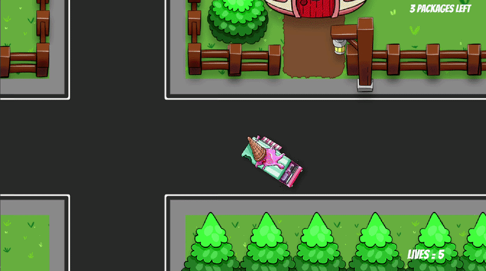
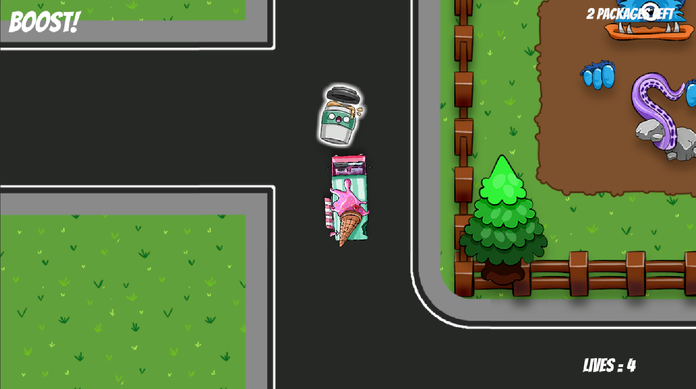
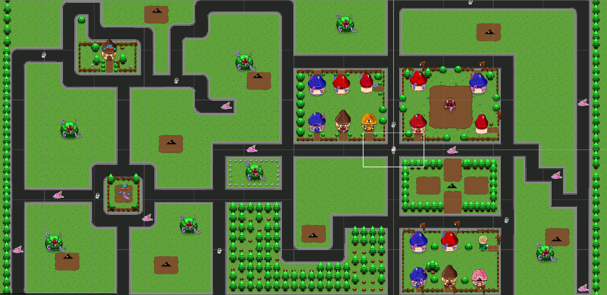

# Unity 2D Delivery Dash

A small 2D delivery game built with Unity and C# while learning game development through the GameDev.tv Unity course on Udemy.

## Features

### Tutorial Features
- Package pickup and delivery system
- Speed boost pickups

### Additional Features Implemented
- Total packages remaining counter
- Total lives system
- Game over state when all lives are lost
- Game completion state when all packages are delivered
- Restriction to only one active speed boost at a time

## Built With
- Unity 6
- C#
- TextMeshPro

## What I Learned
- Collision and trigger handling
- Game state management
- UI updates in Unity
- Particle systems
- Communication between scripts
- Basic gameplay mechanic implementation

## Credits
This project was built while following the GameDev.tv Unity 2D course on Udemy.

Some assets used in this project were provided by the course creators.

## Gameplay

